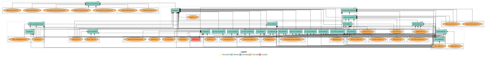

# Api Wallet Share


## Contributors
- [BRIAND Thibaud](https://github.com/ThibaudBr)
- [ARNAUD David-henrie](https://github.com/DH7789-dev)
- [ANGOSTON Lucas](https://github.com/lucasangoston)

## Description
This project is a REST API for the organisation WalletShareOrg.

### Dependencies libraries
- [NodeJS](https://nodejs.org/en/)
- [NPM](https://www.npmjs.com/)
- [PostgreSQL](https://www.postgresql.org/)
- [Docker](https://www.docker.com/)
- [Docker Compose](https://docs.docker.com/compose/)
- [Nodemon](https://nodemon.io/)
- [Jest](https://jestjs.io/)
- [Supertest](
https://www.npmjs.com/package/supertest)
- [ESLint](https://eslint.org/)
- [Prettier](https://prettier.io/)

### Installation

```bash
npm install
```

### Run

```bash
npm run start
```

### Test

```bash
npm run test
```

### API Documentation

```bash
npm run documentation:serve
```

### Application Dependencies


### API Routes V_0.0.4


### Database Schema V_0.0.2

